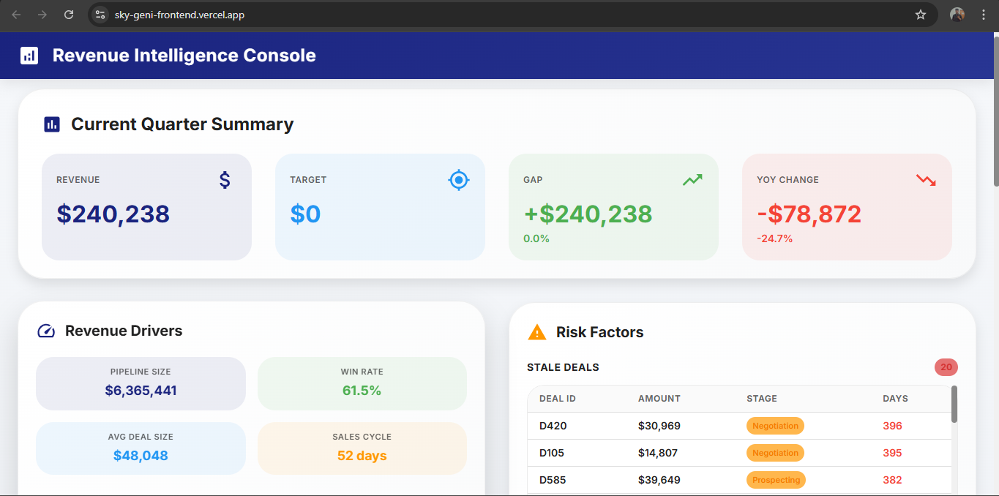

# Revenue Intelligence Console

> A professional dashboard application that helps CROs (Chief Revenue Officers) understand revenue performance, identify risks, and get actionable recommendations.

🌐 **Live Demo**: [https://sky-geni-frontend.vercel.app/](https://sky-geni-frontend.vercel.app/)

   

*A comprehensive dashboard for revenue analysis and strategic decision-making*

---

## ✨ Features

- 📊 **Revenue Summary** - Current quarter performance vs targets with YoY/QoQ comparisons
- 🎯 **Revenue Drivers** - Pipeline size, win rate, average deal size, and sales cycle analysis
- ⚠️ **Risk Factors** - Identifies stale deals, underperforming reps, and low-activity accounts
- 💡 **Smart Recommendations** - AI-powered actionable insights prioritized by impact

## 🛠️ Tech Stack

**Backend:**
- Node.js + Express + TypeScript
- SQLite (better-sqlite3)
- RESTful API

**Frontend:**
- React 18 + TypeScript
- Material UI (MUI)
- D3.js for data visualization

## 🚀 Quick Start

### Prerequisites
- Node.js v16+
- npm

### Local Setup

**Backend:**
```bash
cd backend
npm install
Copy-Item .env.example .env  # Windows
npm run seed
npm run dev
```

**Frontend:**
```bash
cd frontend
npm install
Copy-Item .env.example .env  # Windows
npm start
```

Visit `http://localhost:3000`

## 📡 API Endpoints

- `GET /api/summary` - Revenue summary with gap analysis
- `GET /api/drivers` - Revenue driver metrics
- `GET /api/risk-factors` - Risk identification
- `GET /api/recommendations` - Actionable recommendations

## 🔧 Environment Variables

**Backend** (`backend/.env`):
```env
PORT=3001
NODE_ENV=development
DB_PATH=./data/revenue.db
FRONTEND_URL=http://localhost:3000
```

**Frontend** (`frontend/.env`):
```env
REACT_APP_API_URL=http://localhost:3001
```

## 📦 Deployment

### Backend (Render)
- Root Directory: `backend`
- Build Command: `npm install --production=false && npm run build`
- Start Command: `npm start`
- Environment: `NODE_ENV=production`, `DB_PATH=./data/revenue.db`, `FRONTEND_URL=<vercel-url>`

### Frontend (Vercel)
- Root Directory: `frontend`
- Build Command: `npm run build`
- Environment: `REACT_APP_API_URL=<render-backend-url>`

## 📁 Project Structure

```
.
├── backend/          # Express API
│   ├── src/
│   │   ├── routes/  # API endpoints
│   │   ├── services/# Business logic
│   │   └── db/      # Database
│   └── scripts/     # Seed script
├── frontend/        # React app
│   └── src/
│       ├── components/  # UI components
│       └── services/    # API client
└── data/            # JSON data files
```

## 🔗 Live URLs

- **Frontend**: [https://sky-geni-frontend.vercel.app/](https://sky-geni-frontend.vercel.app/)
- **Backend API**: Your Render backend URL (set in frontend env)

## 📝 License

ISC

---

Built with ❤️ for revenue intelligence
